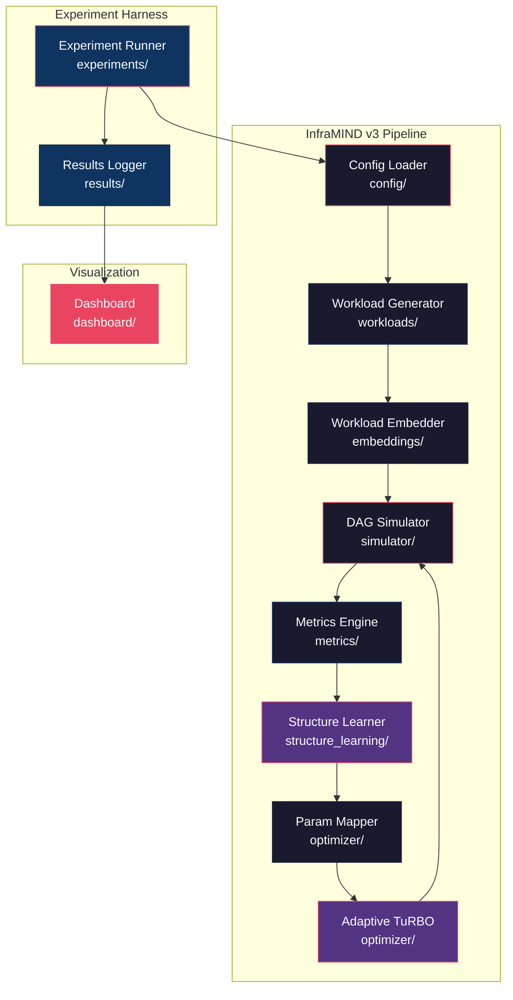

# InfraMIND v3 — Implementation Plan

> **Workload-Aware, Structure-Learning, Stability-Optimized Infrastructure Intelligence under High-Dimensional Constraints**

---

## 1. Executive Summary

InfraMIND v3 is a research-grade Python system that learns workload-aware infrastructure policies by exploiting structural dependencies across microservices, maintaining sample efficiency via adaptive trust-region Bayesian optimization, and optimizing for operational stability — not just threshold compliance. The implementation consists of **7 core modules**, a **visual dashboard**, and a **full experimental harness** covering 5 baselines, 4 ablations, and cross-workload generalization tests.

> **Core Thesis:** *We argue that infrastructure optimization is fundamentally a structured, workload-conditioned problem rather than a flat black-box search task. Systems that ignore workload dynamics and inter-service structure are provably sample-inefficient and operationally unstable.*

---

## 1.1 Explicit Novel Contributions

This work introduces three novel techniques that collectively advance the state of infrastructure optimization:

| # | Contribution | What's New | Why It Matters |
|---|-------------|-----------|----------------|
| **C1** | **Workload-Sensitive Trust Region Adaptation** | Trust region length scales inversely with workload burstiness: `L_adapted = L_base / (1 + α·σ²/μ)` | Prevents catastrophic exploration under volatile traffic; enables conservative search exactly when the system is most fragile |
| **C2** | **Data-Driven Structure Learning for Parameter Reduction** | Sensitivity-based spectral clustering groups services with similar latency impact profiles | Reduces optimization dimensionality by 40–60% without manual engineering; dimensionality reduction is learned from data, not assumed |
| **C3** | **Stability-Aware Objective for Infrastructure Optimization** | Augments cost+SLA objective with CV² latency variance penalty | Eliminates oscillatory configurations that satisfy P99 thresholds but exhibit unpredictable day-to-day performance |

**Supporting contributions:** Workload-conditioned GP surrogate (C4), multi-service DAG simulation with queue propagation (C5), cross-workload zero-shot generalization evaluation (C6).

---

## 2. User Review Required

> [!IMPORTANT]
> **Technology Stack Decisions**
> - **Optimizer backend**: BoTorch (PyTorch-based) for Gaussian Process surrogates and TuRBO. This requires `torch`, `gpytorch`, `botorch`.
> - **Simulator**: SimPy for discrete-event queue simulation.
> - **Structure Learning**: scikit-learn (spectral clustering, k-means) + custom sensitivity analysis.
> - **Dashboard**: Standalone HTML/CSS/JS with Chart.js / D3.js — no framework dependency, runs by opening `index.html`.
> - **Python version**: 3.10+

> [!WARNING]
> **Computational Requirements**
> - BoTorch GP fitting can be expensive for >50 dimensions. The hierarchical parameter mapper is designed to keep effective dimensionality ≤20.
> - Full experimental suite (5 baselines × 3 workloads × 4 ablations × 50 BO iterations) ≈ **2,000+ simulation runs**. Estimated wall time: 30–90 minutes on a modern CPU.

> [!CAUTION]
> **Scope Decision**: The dashboard is a **results visualization tool** (reads JSON results), NOT a live control plane. Building a real-time orchestrator would be a separate project.

---

## 3. Architecture Overview



---

## 4. Repository Structure

```
InfraMIND/
├── README.md                          # Project overview + quickstart
├── requirements.txt                   # Python dependencies
├── setup.py                           # Package setup
├── pyproject.toml                     # Modern Python packaging
│
├── config/
│   ├── __init__.py
│   ├── default_config.yaml            # Default DAG topology + params
│   └── settings.py                    # Global settings & constants
│
├── workloads/
│   ├── __init__.py
│   ├── generator.py                   # Workload trace generation
│   └── profiles.py                    # Steady / Diurnal / Bursty profiles
│
├── embeddings/
│   ├── __init__.py
│   └── workload_embedder.py           # Feature extraction → z vector
│
├── simulator/
│   ├── __init__.py
│   ├── dag.py                         # DAG topology definition
│   ├── service_node.py                # Individual service simulation
│   ├── request.py                     # Request object with timing
│   └── engine.py                      # SimPy simulation orchestrator
│
├── metrics/
│   ├── __init__.py
│   └── stability_metrics.py           # P50/P90/P99, variance, SLA violations
│
├── structure_learning/
│   ├── __init__.py
│   ├── sensitivity.py                 # Parameter sensitivity analysis
│   └── cluster.py                     # Service clustering (spectral/k-means)
│
├── optimizer/
│   ├── __init__.py
│   ├── param_mapper.py                # Hierarchical θ → full config mapping
│   ├── adaptive_turbo.py              # Workload-sensitive TuRBO
│   ├── surrogate.py                   # Workload-conditioned GP model
│   ├── acquisition.py                 # Custom acquisition function
│   └── baselines.py                   # Static, Reactive, Vanilla BO, Standard TuRBO
│
├── experiments/
│   ├── __init__.py
│   ├── runner.py                      # Main experiment orchestrator
│   ├── ablation.py                    # Ablation study driver
│   └── generalization.py              # Cross-workload generalization test
│
├── dashboard/
│   ├── index.html                     # Main dashboard entry point
│   ├── style.css                      # Premium dark-mode styling
│   ├── app.js                         # Dashboard logic + chart rendering
│   └── assets/                        # Icons, fonts
│
├── results/
│   └── .gitkeep                       # Results output directory
│
├── tests/
│   ├── test_simulator.py
│   ├── test_embedder.py
│   ├── test_optimizer.py
│   ├── test_structure_learning.py
│   └── test_metrics.py
│
└── scripts/
    ├── run_full_experiment.py          # End-to-end experiment script
    ├── run_single_optimization.py      # Single optimization loop demo
    └── visualize_results.py            # Generate plots from results/
```

---

## 5. Proposed Changes — Module-by-Module

---

### 5.1 Configuration Layer

#### [NEW] [default_config.yaml](file:///c:/Users/ankan/Desktop/Academics/InfraMIND/config/default_config.yaml)

Defines the default microservice DAG topology and parameter search bounds:

```yaml
dag:
  services:
    - name: api_gateway
      base_service_time: 5      # ms
      base_replicas: 2
      downstream: [auth, catalog]
    - name: auth
      base_service_time: 10
      base_replicas: 2
      downstream: [user_db]
    - name: catalog
      base_service_time: 15
      base_replicas: 3
      downstream: [product_db, recommendation]
    - name: recommendation
      base_service_time: 25
      base_replicas: 2
      downstream: [ml_engine]
    - name: ml_engine
      base_service_time: 50
      base_replicas: 4
      downstream: []
    - name: user_db
      base_service_time: 8
      base_replicas: 2
      downstream: []
    - name: product_db
      base_service_time: 12
      base_replicas: 2
      downstream: []

parameters:
  per_service:
    replicas: { min: 1, max: 16, type: int }
    cpu_millicores: { min: 100, max: 4000, type: int }
    memory_mb: { min: 128, max: 8192, type: int }
    queue_capacity: { min: 10, max: 500, type: int }
  global:
    load_balancer_algo: { choices: [round_robin, least_conn, random] }
    connection_pool_size: { min: 5, max: 100, type: int }

optimization:
  n_initial: 20
  n_iterations: 50
  batch_size: 4
  turbo:
    length_init: 0.8
    length_min: 0.005
    length_max: 1.6
    success_tolerance: 3
    failure_tolerance: 5

objectives:
  sla_target_p99_ms: 200
  lambda_sla: 10.0
  lambda_variance: 2.0
  cost_per_replica_per_hour: 0.05
```

#### [NEW] [settings.py](file:///c:/Users/ankan/Desktop/Academics/InfraMIND/config/settings.py)

Global constants, random seeds, logging configuration.

---

### 5.2 Workload Generation

#### [NEW] [generator.py](file:///c:/Users/ankan/Desktop/Academics/InfraMIND/workloads/generator.py)

Generates synthetic workload traces as time-series of request arrival rates.

**Key functions:**
- `generate_trace(profile, duration_s, resolution_s) → np.ndarray` — returns array of arrival rates
- `add_noise(trace, noise_level) → np.ndarray` — adds Gaussian noise
- `inject_bursts(trace, n_bursts, burst_magnitude, burst_duration) → np.ndarray`

#### [NEW] [profiles.py](file:///c:/Users/ankan/Desktop/Academics/InfraMIND/workloads/profiles.py)

Three workload profiles:

| Profile | Description | Mathematical Form |
|---------|-------------|-------------------|
| **Steady** | Constant rate + small noise | `λ(t) = λ₀ + ε` |
| **Diurnal** | 24h sinusoidal pattern | `λ(t) = λ₀ + A·sin(2πt/T) + ε` |
| **Bursty** | Poisson-modulated spikes | `λ(t) = λ₀ + Σ burst_i · rect(t - tᵢ)` |

---

### 5.3 Workload Embedder ⟵ **Contribution C1**

#### [NEW] [workload_embedder.py](file:///c:/Users/ankan/Desktop/Academics/InfraMIND/embeddings/workload_embedder.py)

Extracts a fixed-dimensional embedding vector `z ∈ ℝ⁵` from a workload trace window:

```python
z = [
    mean_rate,           # μ(λ)
    std_rate,            # σ(λ)
    burstiness,          # σ²/μ  (index of dispersion)
    autocorrelation,     # lag-1 autocorrelation
    peak_to_avg_ratio    # max(λ) / μ(λ)
]
```

**Key class:** `WorkloadEmbedder`
- `embed(trace_window: np.ndarray) → np.ndarray` — returns 5D embedding
- `embed_batch(traces: List[np.ndarray]) → np.ndarray` — batch embedding
- `compute_volatility(trace_window: np.ndarray) → float` — used by adaptive TuRBO

---

### 5.4 DAG Simulator ⟵ **Contribution C5**

#### [NEW] [dag.py](file:///c:/Users/ankan/Desktop/Academics/InfraMIND/simulator/dag.py)

Defines the service DAG topology:
- `ServiceDAG` class: loads from YAML config, provides adjacency list, topological sort, critical path analysis

#### [NEW] [service_node.py](file:///c:/Users/ankan/Desktop/Academics/InfraMIND/simulator/service_node.py)

Individual service simulation node:
- `ServiceNode(env, name, config)` — SimPy process
- Models: `simpy.Resource` for replicas, `simpy.Store` for request queue
- Service time: `Exponential(1/base_service_time)` scaled by CPU allocation
- Queue overflow → request drop (tracked as SLA violation)

#### [NEW] [request.py](file:///c:/Users/ankan/Desktop/Academics/InfraMIND/simulator/request.py)

Request data class tracking:
- `created_at`, `completed_at` — for end-to-end latency
- `path: List[str]` — services visited
- `per_hop_latencies: Dict[str, float]`
- `dropped: bool`

#### [NEW] [engine.py](file:///c:/Users/ankan/Desktop/Academics/InfraMIND/simulator/engine.py)

Main simulation orchestrator:

```python
class SimulationEngine:
    def __init__(self, dag: ServiceDAG, config: Dict):
        self.env = simpy.Environment()
        self.dag = dag
        self.nodes = self._build_nodes(config)
    
    def run(self, workload_trace: np.ndarray, duration: float) -> SimulationResult:
        """Run full simulation, return latency distribution + cost"""
        self.env.process(self._request_generator(workload_trace))
        self.env.run(until=duration)
        return self._collect_results()
```

**SimulationResult** contains:
- `latencies: np.ndarray` — all end-to-end latencies
- `per_service_latencies: Dict[str, np.ndarray]`
- `dropped_count: int`
- `total_cost: float` — Σ replicas × cost_per_replica × duration

---

### 5.5 Stability-Aware Metrics Engine ⟵ **Contribution C4**

#### [NEW] [stability_metrics.py](file:///c:/Users/ankan/Desktop/Academics/InfraMIND/metrics/stability_metrics.py)

Computes the full objective from simulation results:

```python
class StabilityMetrics:
    def compute(self, result: SimulationResult, config: Dict) -> ObjectiveValue:
        p50 = np.percentile(result.latencies, 50)
        p90 = np.percentile(result.latencies, 90)
        p99 = np.percentile(result.latencies, 99)
        
        sla_violations = np.mean(result.latencies > config['sla_target_p99_ms'])
        latency_variance = np.var(result.latencies)
        
        cost = result.total_cost
        
        # Stability-aware objective
        objective = (
            cost 
            + config['lambda_sla'] * sla_violations 
            + config['lambda_variance'] * latency_variance
        )
        
        return ObjectiveValue(
            objective=objective,
            cost=cost,
            p50=p50, p90=p90, p99=p99,
            sla_violations=sla_violations,
            latency_variance=latency_variance
        )
```

**Why latency variance matters:** Two configs can have identical P99 but wildly different day-to-day consistency. The variance term penalizes oscillatory behavior that makes systems unpredictable.

---

### 5.6 Structure Learner ⟵ **Contribution C2**

#### [NEW] [sensitivity.py](file:///c:/Users/ankan/Desktop/Academics/InfraMIND/structure_learning/sensitivity.py)

Computes parameter sensitivity matrix via perturbation analysis:

```python
class SensitivityAnalyzer:
    def compute_sensitivity_matrix(self, dag, base_config, workload) -> np.ndarray:
        """
        Returns S ∈ ℝ^(n_services × n_params)
        S[i,j] = ∂latency / ∂θ_ij  (finite difference approximation)
        """
        # For each service i, each param j:
        #   perturb θ_ij by ±δ
        #   run simulation
        #   compute (latency+ - latency-) / (2δ)
```

#### [NEW] [cluster.py](file:///c:/Users/ankan/Desktop/Academics/InfraMIND/structure_learning/cluster.py)

Clusters services based on sensitivity profiles:

```python
class ServiceClusterer:
    def cluster(self, sensitivity_matrix: np.ndarray, method='spectral', n_clusters=None) -> List[Set[str]]:
        """
        Auto-determine n_clusters via silhouette score if not provided.
        Returns groups of services that should share parameters.
        """
        # 1. Normalize sensitivity matrix
        # 2. Compute similarity (correlation or RBF kernel)
        # 3. Spectral clustering / k-means
        # 4. Return clusters
```

**Output example:**
```python
[
    {'api_gateway', 'auth'},           # lightweight frontend services
    {'catalog', 'recommendation'},     # compute-medium services
    {'ml_engine'},                     # compute-heavy singleton
    {'user_db', 'product_db'}          # database services
]
```

---

### 5.7 Hierarchical Parameter Mapper

#### [NEW] [param_mapper.py](file:///c:/Users/ankan/Desktop/Academics/InfraMIND/optimizer/param_mapper.py)

Maps low-dimensional θ → full service configuration:

```python
class HierarchicalParamMapper:
    def __init__(self, clusters: List[Set[str]], param_bounds: Dict):
        self.clusters = clusters
        # Effective dimensionality = n_clusters × n_per_service_params + n_global_params
    
    def decode(self, theta: np.ndarray) -> Dict[str, Dict]:
        """Map optimizer's θ vector to per-service configuration"""
        config = {}
        idx = 0
        for cluster in self.clusters:
            cluster_params = theta[idx:idx+self.n_params_per_cluster]
            for service in cluster:
                config[service] = self._expand_params(cluster_params)
            idx += self.n_params_per_cluster
        # Global params
        config['_global'] = self._expand_global(theta[idx:])
        return config
    
    @property
    def effective_dim(self) -> int:
        return len(self.clusters) * self.n_params_per_cluster + self.n_global_params
```

---

### 5.8 Adaptive TuRBO Optimizer ⟵ **Contribution C3**

#### [NEW] [surrogate.py](file:///c:/Users/ankan/Desktop/Academics/InfraMIND/optimizer/surrogate.py)

Workload-conditioned Gaussian Process:

```python
class WorkloadConditionedGP:
    """
    GP surrogate: f(θ, z) → objective
    Input space: [θ_reduced ∥ z_workload]
    Kernel: Matérn-5/2 with separate lengthscales for θ and z dims
    """
    def __init__(self, theta_dim: int, z_dim: int = 5):
        self.input_dim = theta_dim + z_dim
        # Uses BoTorch SingleTaskGP with ARD kernel
    
    def fit(self, X: Tensor, Y: Tensor):
        """Fit GP to observed (θ∥z, objective) pairs"""
    
    def predict(self, X: Tensor) -> Tuple[Tensor, Tensor]:
        """Return posterior mean and variance"""
```

#### [NEW] [adaptive_turbo.py](file:///c:/Users/ankan/Desktop/Academics/InfraMIND/optimizer/adaptive_turbo.py)

The core novel optimizer:

```python
class AdaptiveTuRBO:
    """
    TuRBO with workload-sensitive trust region adaptation.
    
    Key innovation: trust region size adapts based on:
    1. Standard success/failure counters (vanilla TuRBO)
    2. Workload volatility scaling factor
    
    trust_region_length = base_length × volatility_factor
    
    where volatility_factor = 1 / (1 + α·burstiness)
    
    Effect:
    - Stable workloads (low burstiness) → larger trust region → more exploration
    - Bursty workloads (high burstiness) → tighter trust region → safer, conservative search
    """
    
    def __init__(self, dim, bounds, config):
        self.dim = dim
        self.bounds = bounds
        self.length = config['length_init']
        self.length_min = config['length_min']
        self.length_max = config['length_max']
        self.success_tolerance = config['success_tolerance']
        self.failure_tolerance = config['failure_tolerance']
        self.success_counter = 0
        self.failure_counter = 0
        self.best_value = float('inf')
        self.volatility_alpha = 1.5  # sensitivity to burstiness
    
    def get_trust_region(self, center, workload_volatility):
        """Compute trust region bounds adapted to workload volatility"""
        volatility_factor = 1.0 / (1.0 + self.volatility_alpha * workload_volatility)
        adapted_length = self.length * volatility_factor
        # Clamp to [length_min, length_max]
        adapted_length = np.clip(adapted_length, self.length_min, self.length_max)
        
        lb = np.clip(center - adapted_length / 2, 0.0, 1.0)
        ub = np.clip(center + adapted_length / 2, 0.0, 1.0)
        return lb, ub
    
    def update_state(self, new_value):
        """Update trust region based on improvement"""
        if new_value < self.best_value - 1e-3 * abs(self.best_value):
            self.success_counter += 1
            self.failure_counter = 0
        else:
            self.failure_counter += 1
            self.success_counter = 0
        
        if self.success_counter >= self.success_tolerance:
            self.length = min(2.0 * self.length, self.length_max)
            self.success_counter = 0
        elif self.failure_counter >= self.failure_tolerance:
            self.length = self.length / 2.0
            self.failure_counter = 0
        
        if new_value < self.best_value:
            self.best_value = new_value
    
    def suggest(self, model, center, workload_volatility, n_candidates=5000):
        """Generate candidates within adapted trust region using Thompson sampling"""
        lb, ub = self.get_trust_region(center, workload_volatility)
        # Sobol sampling within trust region
        # Evaluate acquisition function (Expected Improvement)
        # Return best candidate
```

#### [NEW] [acquisition.py](file:///c:/Users/ankan/Desktop/Academics/InfraMIND/optimizer/acquisition.py)

Custom acquisition wrapping BoTorch's `ExpectedImprovement` within the adapted trust region.

#### [NEW] [baselines.py](file:///c:/Users/ankan/Desktop/Academics/InfraMIND/optimizer/baselines.py)

Implements all baseline strategies:

| Baseline | Implementation |
|----------|---------------|
| **B1: Static** | Fixed median config, no adaptation |
| **B2: Reactive** | Threshold-based scaling with configurable cooldown (mimics HPA) |
| **B3: Vanilla BO** | Standard GP-EI over full parameter space, no workload conditioning |
| **B4: Standard TuRBO** | TuRBO without workload adaptation or structure learning |
| **B5: InfraMIND v3** | Full system (used as reference) |

---

### 5.9 Experiment Harness

#### [NEW] [runner.py](file:///c:/Users/ankan/Desktop/Academics/InfraMIND/experiments/runner.py)

Main experiment orchestrator:

```python
class ExperimentRunner:
    def run_comparison(self, methods, workloads, n_trials=3):
        """Run all methods across all workloads, log results"""
        for method in methods:
            for workload in workloads:
                for trial in range(n_trials):
                    result = self._run_single(method, workload, trial)
                    self._log_result(result)
    
    def _run_single(self, method, workload, trial):
        """Single optimization run"""
        # 1. Generate workload trace
        # 2. Initialize method
        # 3. Run optimization loop
        # 4. Return best config + metrics trajectory
```

#### [NEW] [ablation.py](file:///c:/Users/ankan/Desktop/Academics/InfraMIND/experiments/ablation.py)

Ablation study removing one component at a time:

| Ablation | What's Removed | Expected Impact |
|----------|---------------|-----------------|
| `-embedding` | Workload conditioning (z=0) | Worse on bursty workloads |
| `-structure` | Structure learning (flat params) | Higher dimensionality, slower convergence |
| `-adaptive_tr` | Adaptive trust region (fixed TR) | More instability under bursty loads |
| `-stability` | Variance term (λ₂=0) | Higher latency oscillation |

#### [NEW] [generalization.py](file:///c:/Users/ankan/Desktop/Academics/InfraMIND/experiments/generalization.py)

Cross-workload generalization test:
- **Train**: Steady + Diurnal workloads
- **Test**: Bursty workload (unseen)
- Evaluates zero-shot transfer capability of the workload-conditioned model

---

### 5.10 Dashboard ⟵ Results Visualization

#### [NEW] [index.html](file:///c:/Users/ankan/Desktop/Academics/InfraMIND/dashboard/index.html)

Premium dark-mode dashboard with:

1. **Pareto Frontier View** — Cost vs P99 Latency scatter for all methods
2. **Convergence Curves** — Objective value over iterations per method
3. **Workload Comparison** — Side-by-side performance across Steady/Diurnal/Bursty
4. **Ablation Heatmap** — Impact of removing each component
5. **Service Cluster Visualization** — DAG graph with cluster coloring
6. **Latency Distribution** — Violin plots of per-method latency distributions
7. **Trust Region Dynamics** — Animated trust region evolution over iterations
8. **Stability Analysis** — Latency variance comparison across methods

**Design:**
- Glassmorphism panels with `backdrop-filter: blur(20px)`
- Dark background (`#0a0a1a`) with vibrant accent gradients
- Inter font from Google Fonts
- Smooth reveal animations on scroll
- Interactive chart hover states
- Responsive 2-column grid layout

#### [NEW] [style.css](file:///c:/Users/ankan/Desktop/Academics/InfraMIND/dashboard/style.css)
#### [NEW] [app.js](file:///c:/Users/ankan/Desktop/Academics/InfraMIND/dashboard/app.js)

---

### 5.11 Scripts

#### [NEW] [run_full_experiment.py](file:///c:/Users/ankan/Desktop/Academics/InfraMIND/scripts/run_full_experiment.py)

End-to-end: generates workloads → runs all methods → runs ablations → runs generalization → saves all results to `results/`.

#### [NEW] [run_single_optimization.py](file:///c:/Users/ankan/Desktop/Academics/InfraMIND/scripts/run_single_optimization.py)

Quick demo: single InfraMIND v3 optimization loop with live console output.

#### [NEW] [visualize_results.py](file:///c:/Users/ankan/Desktop/Academics/InfraMIND/scripts/visualize_results.py)

Generates matplotlib plots + exports data as JSON for the dashboard.

---

## 6. Dependency Chain & Build Order

The implementation follows strict dependency order:

```mermaid
gantt
    title InfraMIND v3 Implementation Phases
    dateFormat  X
    axisFormat %s

    section Phase 1: Foundation
    Config + Settings           :p1a, 0, 1
    Request data class          :p1b, 0, 1
    Workload Profiles           :p1c, 0, 1
    Workload Generator          :p1d, 1, 2
    Workload Embedder           :p1e, 1, 2

    section Phase 2: Simulation
    DAG topology                :p2a, 2, 3
    Service Node                :p2b, 2, 3
    Simulation Engine           :p2c, 3, 4
    Stability Metrics           :p2d, 4, 5

    section Phase 3: Intelligence
    Sensitivity Analyzer        :p3a, 5, 6
    Service Clusterer           :p3b, 6, 7
    Param Mapper                :p3c, 7, 8
    Surrogate GP                :p3d, 5, 7
    Adaptive TuRBO              :p3e, 7, 9
    Acquisition Function        :p3f, 7, 9
    Baselines                   :p3g, 5, 7

    section Phase 4: Experiments
    Experiment Runner           :p4a, 9, 10
    Ablation Driver             :p4b, 10, 11
    Generalization Test         :p4c, 10, 11

    section Phase 5: Visualization
    Dashboard HTML/CSS/JS       :p5a, 11, 13
    Result Visualizer Script    :p5b, 11, 12

    section Phase 6: Polish
    Tests                       :p6a, 13, 14
    README + Docs               :p6b, 14, 15
```



---

## 7. Mathematical Formulations — Implementation Details

### 7.1 Objective Function

$$\min_{\theta \in \Theta} \; \mathbb{E}_{W \sim \mathcal{D}} \left[ \text{Cost}(\theta, W) + \lambda_1 \cdot \text{SLA}_{\text{viol}} + \lambda_2 \cdot \text{Var}(\text{Latency}) \right]$$

Subject to: $P_{99}(\text{Latency}_{e2e}) \leq L_{\text{target}}$

**Implementation:** The constraint is softened via the SLA violation penalty (λ₁ = 10.0 by default), making it a penalty-based approach rather than hard-constrained BO.

### 7.2 Trust Region Adaptation

```
adapted_length = base_length × (1 / (1 + α · burstiness(z)))
```

Where `burstiness(z) = σ²/μ` from the workload embedding. This creates a smooth, monotonic relationship between workload volatility and exploration conservatism.

### 7.3 Sensitivity Matrix

$$S_{ij} = \frac{\partial \text{Latency}_{P99}}{\partial \theta_{ij}} \approx \frac{\text{Latency}(\theta + \delta e_{ij}) - \text{Latency}(\theta - \delta e_{ij})}{2\delta}$$

Computed via finite differences with `δ = 0.05` (5% perturbation).

### 7.4 Cost Model

$$\text{Cost}(\theta) = \sum_{s \in \text{Services}} \text{replicas}_s \times \text{cpu\_cost}_s \times T$$

Where `cpu_cost` is proportional to `cpu_millicores / 1000`.

---

## 8. Computational Complexity Analysis

| Component | Time Complexity | Space Complexity |
|-----------|----------------|------------------|
| **Simulation (single run)** | O(N_requests × L_path) | O(N_requests + S_services) |
| **Sensitivity Analysis** | O(S × P × 2 × T_sim) — S services, P params, 2 perturbations each | O(S × P) for sensitivity matrix |
| **GP Fitting** | O(n³) where n = number of observations | O(n² + n×d) for kernel matrix + training data |
| **GP Prediction** | O(n²) per query point | O(n×d) |
| **TuRBO Candidate Generation** | O(C × n²) — C candidates, each requiring GP eval | O(C × d) |
| **Spectral Clustering** | O(S³) for eigendecomposition (S = n_services, typically ≤20) | O(S²) for affinity matrix |
| **Full Optimization Loop** | O(I × (T_sim + n³)) — I iterations | O(I × (d + k)) for GP training data |

**Practical bottleneck:** GP fitting at O(n³) limits us to ~1000–2000 observations. With 20 initial + 50 iterations × 4 batch = 220 total evaluations, we remain well within this budget.

---

## 8.1 Scaling Behavior & Limits

| Scale Factor | Behavior | Mitigation |
|-------------|----------|------------|
| **Large DAGs (>20 services)** | Sensitivity computation grows linearly (2×S×P simulations); becomes expensive at >50 services | Structure learning is computed once and cached; amortized over all BO iterations |
| **High dimensionality (>30 params)** | GP scalability degrades; lengthscale estimation becomes unreliable | Hierarchical param mapper keeps effective dim ≤20 via cluster-based sharing |
| **Long traces (>10K timesteps)** | Simulation wall-time grows; memory for request tracking increases | Warmup-based truncation; only post-warmup requests tracked |
| **Many BO iterations (>200)** | GP fitting time dominates; O(n³) becomes impractical | Switch to sparse GP (inducing points) or local GP ensemble |

> [!NOTE]
> The system relies on hierarchical dimensionality reduction to remain tractable. Without structure learning, a 20-service × 4-param DAG creates an 81D search space — well beyond practical GP limits. With 4 learned clusters, this reduces to 17D.

---

## 8.2 Key Design Decisions

| Decision | Rationale |
|----------|-----------|
| **SimPy over real infrastructure** | Reproducible, fast, no cloud costs. Simulation gap acknowledged in limitations. |
| **BoTorch over custom GP** | Research-grade GP implementation, native TuRBO support, active community. |
| **Spectral clustering over manual grouping** | Data-driven, adapts to different DAG topologies, doesn't require domain expertise. |
| **Penalty-based constraints over hard constraints** | Simpler optimization, avoids feasibility issues in early iterations. |
| **5D workload embedding** | Captures essential statistical properties without overfitting. Extensible to learned embeddings. |
| **Standalone dashboard (no React/Vue)** | Zero-dependency, opens directly in browser, focuses on results visualization. |

---

## 9. Resolved Questions

| Question | Decision | Rationale |
|----------|----------|-----------|
| **Q1: DAG Complexity** | 7 services (baseline) + 12-service scalability test | Shows scalability without overengineering |
| **Q2: BoTorch** | ✅ Keep BoTorch | Research credibility, native TuRBO, no downgrade |
| **Q3: Dashboard** | Static JSON reader | Don't overengineer — focus on results |
| **Q4: Paper Template** | ✅ Yes, scaffold LaTeX | Even a draft matters more than 100 lines of code |

---

## 10. Verification Plan

### 10.1 Automated Tests

```bash
# Unit tests
pytest tests/ -v --tb=short

# Smoke test: single optimization loop
python scripts/run_single_optimization.py --n-iter 5

# Full experiment (longer)
python scripts/run_full_experiment.py --n-trials 1 --n-iter 20
```

**Test coverage targets:**
- Simulator: request propagation, queue overflow, cost calculation
- Embedder: known workload → expected embedding values
- Optimizer: trust region expansion/shrinkage logic
- Structure Learning: known sensitivity matrix → expected clusters
- Metrics: known latency array → correct P50/P90/P99

### 10.2 Integration Verification

1. **Convergence check**: InfraMIND v3 objective should decrease over iterations
2. **Baseline ordering**: v3 should outperform all baselines on at least 2/3 workloads
3. **Ablation monotonicity**: Removing any component should degrade performance
4. **Generalization**: Performance gap between train and test workloads should be <20%

### 10.3 Dashboard Verification

- Open `dashboard/index.html` in browser
- Load sample results JSON
- Verify all 8 chart panels render correctly
- Test responsive layout at different viewport widths

### 10.4 Manual Verification

- Review Pareto frontier for plausibility (cost-latency trade-off should be visible)
- Inspect cluster assignments for semantic correctness (DB services should cluster together)
- Verify trust region dynamics log shows adaptation to workload burstiness
